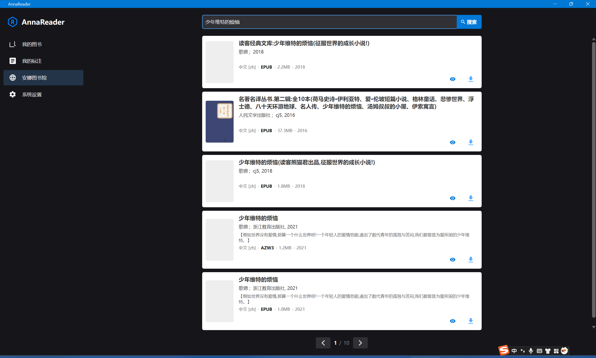
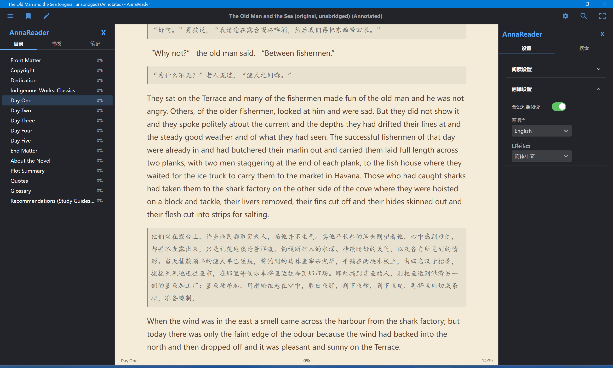
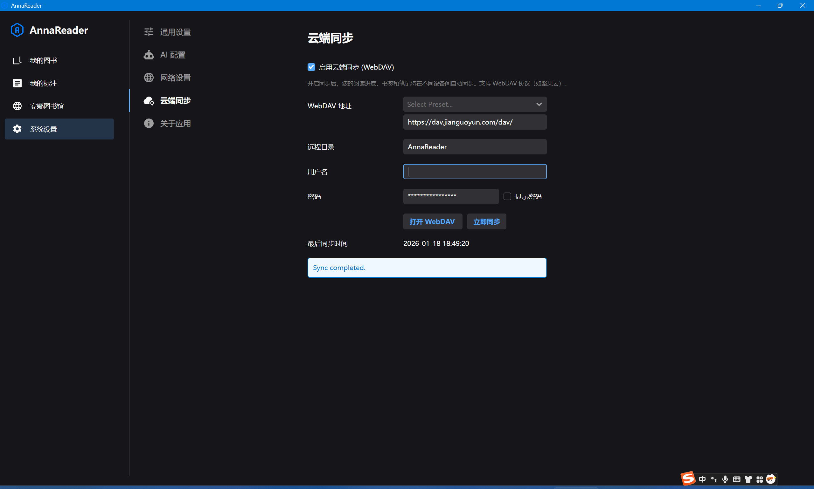
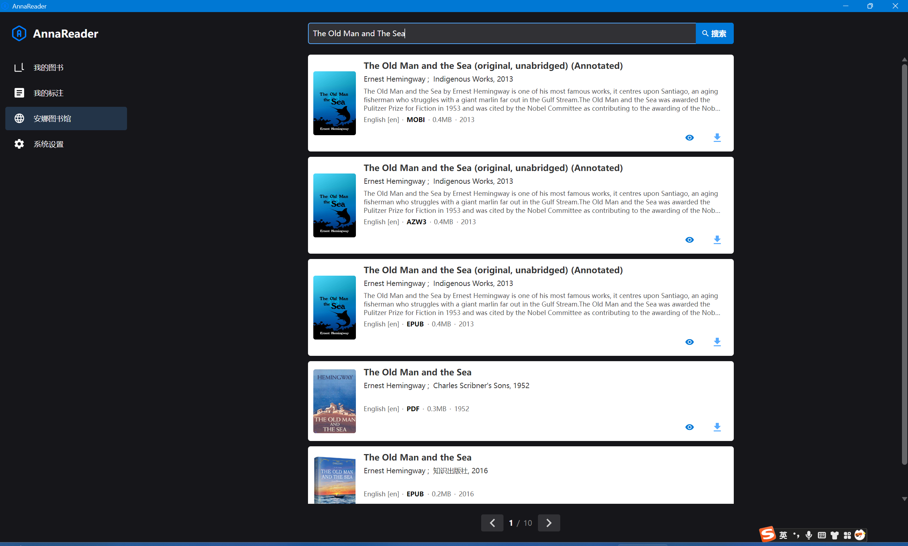
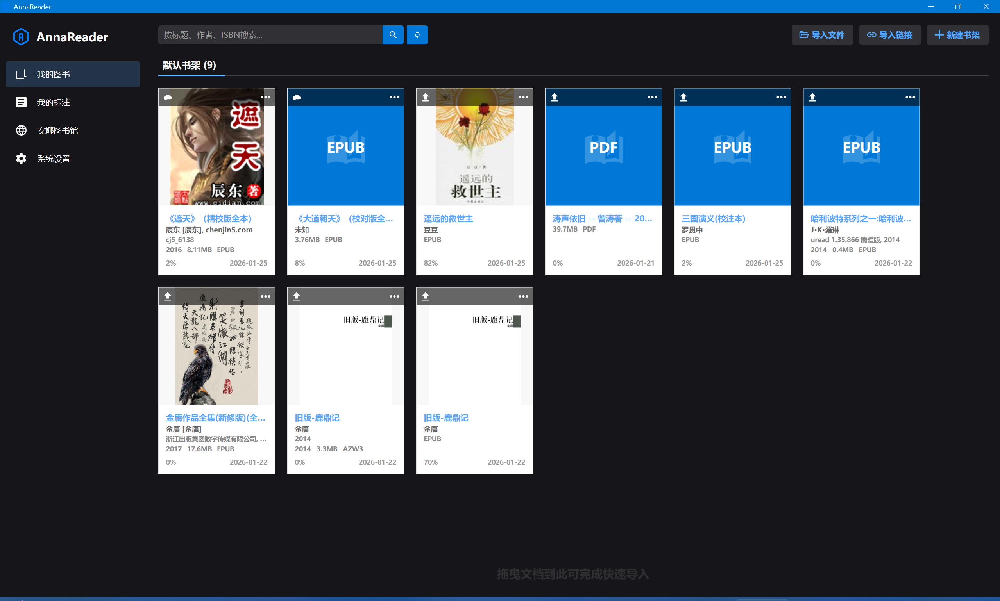
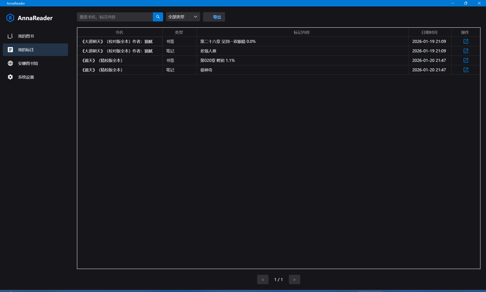

# AnnaReader - Your Ultimate Clean E-book Reader

## 📖 Our Story

In this era of information explosion, books and knowledge remain humanity's most valuable shared wealth. I stumbled upon **Anna's Archive** — the world's largest open-source shadow library, hosting a massive collection of resources. I felt strongly that such precious resources should be accessible to everyone.

However, my search for a decent e-book reader was frustrating. Most existing readers are either flooded with intrusive ads that ruin the reading experience or require mandatory registration and paid memberships. These commercial barriers complicate the simple act of reading and dampen the spirit of book lovers.

Driven by the mission to encourage everyone to **"Read More, Read Good Books,"** I developed **AnnaReader**. It is a **completely free, open-source, ad-free, and privacy-focused** modern e-book reader designed to provide you with the purest and most focused reading experience.

## ✨ Key Features

### 1. 🤖 AI-Powered Bilingual Reading
Break down language barriers with AnnaReader's deep integration of advanced AI translation capabilities (powered by Aliyun Bailian/DashScope).
- **Immersive Bilingual Mode**: Toggle bilingual mode with one click. Original text and translation are displayed paragraph by paragraph—the perfect assistant for learning foreign languages.
- **High-Precision Translation**: Leveraging the contextual understanding of Large Language Models (LLMs) to provide a more accurate and fluent reading experience than traditional translation.

### 2. ☁️ Private Cloud Sync (WebDAV)
Your data belongs to you. No vendor lock-in, no data loss.
- **Data Sovereignty**: Supports standard **WebDAV** protocols (Nextcloud, Nutstore, NAS, etc.) to sync your bookshelf, reading progress, and notes to your own private cloud storage.
- **Multi-Device Sync**: Switch seamlessly between Windows, macOS, and Linux, and pick up right where you left off.

### 3. 📚 Deep Integration with Anna's Archive
This is one of AnnaReader's most unique features. Directly within the app, you can:
- **Search**: Seamlessly access the vast library of Anna's Archive.
- **Download**: Download books directly to your local shelf (via Slow Download channel).
- **View Details**: Get detailed metadata, covers, and descriptions.

### 4. 🛡️ Ultimate Security & Privacy
We understand the importance of privacy, which is why AnnaReader is built on a **"Local-First"** philosophy:
- **No Tracking**: No user behavior tracking or data collection.
- **Local Storage**: Your bookshelf, reading progress, and notes are all stored locally.
- **Secure Network Requests**: Network requests are only made when you actively search/download books or sync. Proxy settings are supported to ensure your network security.

### 5. 🗂️ Powerful Library Management
- **Smart Import**: Batch import files and folders.
- **Bookshelves**: Create custom shelves to manage thousands of books easily.
- **Full-Text Search**: Quickly find books in your local library.

### 6. 📝 Rich Reading Tools
- **All-Round Format Support**: PDF, EPUB, MOBI (Auto-convert), AZW3, TXT, Markdown.
- **Customization**: Adjust fonts, backgrounds, and night mode to your liking.
- **Notes & Annotations**: Highlight, underline, write thoughts, and back them up via WebDAV.

### 7. Cross-Platform Support
AnnaReader is with you, no matter what device you use:
- **Windows**
- **macOS**
- **Linux**

## 📥 Download

Please visit the [Releases](https://github.com/Metatome/AnnaReader/releases) page of this repository to download the latest version for your system.

## 📖 User Manual

For detailed instructions, please refer to:
- [English Manual](docs/MANUAL_EN.md)
- [中文用户手册](docs/MANUAL_CN.md)

## 🤝 Contribution

AnnaReader is an open-source project. We welcome Issues and Pull Requests to help improve this tool for book lovers everywhere.

---
*May AnnaReader be your trusty companion in exploring the ocean of knowledge.*
